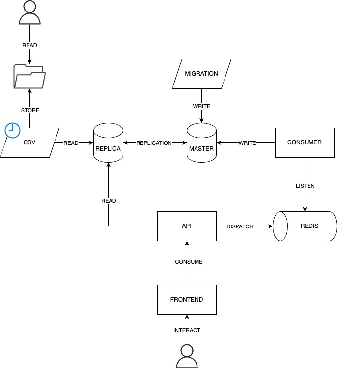

# Study Case

## Description
Possuimos uma aplicação de votação simples que permite aos usuários escolher entre 2 ou mais opções de resposta.  

Nossa aplicação hoje roda com Docker e é composta por:
- `api`: Container que roda o **backend** em Python.
- `frontend`: Container que roda o **servidor web** Nginx (HTML, CSS e JS).
- `mysql-master`: Container que roda o **banco de dados** MySQL para **escrita**.
- `mysql-replica`: Container que roda o **banco de dados** MySQL para **leitura**.
- `redis`: Container que roda o **banco de dados** Redis, nós utilizamos primariamente como **fila de mensagens**.
- `job-migration`: Container que roda um **job** em Python para **migrar** as tabelas iniciais para o MySQL.
- `job-csv`: Container que roda um **job** em Python para **exportar** os dados do MySQL Replica para arquivo CSV que precisa rodar a cada 5min.
- `consumer`: Container que fica escutando a **fila de mensagens** do Redis e **salva** os votos no MySQL.

Nosso Banco de Dados é o MySQL, que roda em um serviço da nuvem, porém, queremos que ele rode em um container Docker,
pois o custo de manter o banco de dados na nuvem está muito alto.

Hoje nós usamos o Docker Compose para subir a aplicação, porém, queremos que você nos ajude a migrar para o Kubernetes.

Nossas aplicações `api`, `job-migration`, `job-csv` e `consumer` necessitam de environment variables para funcionarem corretamente. As variáveis de ambiente necessárias são:
- `DB_HOST`: Host do banco de dados MySQL.
- `DB_USER`: Usuário do banco de dados MySQL.
- `DB_PASSWORD`: Senha do banco de dados MySQL.
- `DB_DATABASE`: Nome do banco de dados MySQL.
- `REDIS_HOST`: Host do banco de dados Redis.

Gostariamos de continuar aplicando o Banco de Dados MySQL na arquitetura Master-Slave, para garantir a alta disponibilidade.

A única forma de ver os resultados dos surveys é quando o `job-csv` é executado, pois ele exporta os dados do MySQL Replica para um arquivo CSV, esse csv deve ser gravado em disco persistente.

O `job-migration` é um job que deve ser executado apenas uma vez, ele é responsável por criar as tabelas iniciais no MySQL.

Durante o processo de `build` do `frontend` é necessário informar no ARGS o endereço da API, pois o frontend precisa saber onde está a API para fazer as requisições. Exemplo:
```sh
docker compose build frontend --build-arg API_URL=http://localhost:80000
```

A aplicação `consumer` pode/deve ser escalada horizontalmente, pois ela é responsável por salvar os votos no MySQL.

---

## Como subir o ambiente?

#### Subir os Containers

```sh
docker compose up -d
```

#### Habilitar Replica MySQL

```sh
sh mysqld.sh
```

---

## Diagrama de arquitetura



---


## Solucionando o problema

#### api
  - Kubernetes
    - Pod
    - Deployment
    - Service (NodePort)
    - Secrets
    - ConfigMap
  - Imagem Docker

#### frontend
  - Kubernetes
    - Pod
    - Deployment
    - Service (NodePort)
  - Imagem Docker

#### job-migration
  - Kubernetes
    - Job
    - Secrets
    - ConfigMap
  - Imagem Docker

#### job-csv
  - Kubernetes
    - Cronjob
    - Secrets
    - ConfigMap
    - PersistentVolume (NFS)
    - PersistentVolumeClaim (ReadWriteOnce)
  - Imagem Docker

#### consumer
  - Kubernetes
    - Pod
    - Deployment
    - Secrets
    - ConfigMap
  - Imagem Docker

#### redis
  - Kubernetes
    - Pod
    - Deployment
    - Service (ClusterIP)
  - Imagem Docker

#### mysql-master
  - Kubernetes
    - Pod
    - StatefulSet (1 replica)
    - Secret
    - ConfigMap*
  - Imagem Docker

#### mysql-replica
  - Kubernetes
    - Pod
    - StatefulSet (1 replica)
    - Secret
    - ConfigMap*
  - Imagem Docker