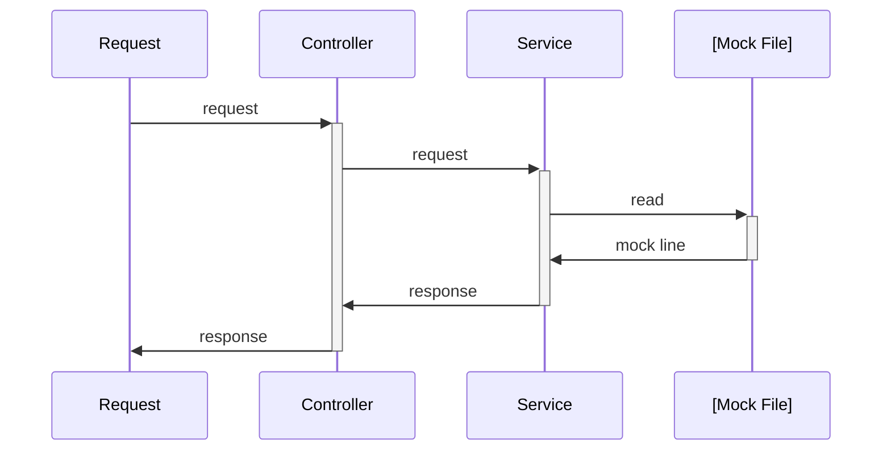

<div align="center">
  <h1>⚡️ HTTP Mock Server</h1>
  
</div>

# ➤ About The Project

This project is a HTTP Mock Server, thought to support development of API Rest that don't have full implementation yet.  
So you can use as a frontend developer to mock a server-side backend, or as a backend developer you can use to mock other microservice.

- [➤ About The Project](#-about-the-project)
- [♨︎ Cookbook](#︎-cookbook)
  - [Native Routes](#native-routes)
  - [Configure your routes](#configure-your-routes)
    - [1. Mock File Structure](#1-mock-file-structure)
- [Start Project](#start-project)
    - [🐳 Docker (Recommended)](#-docker-recommended)
    - [📦 Build with Rust locally](#-build-with-rust-locally)
  - [Request Mock](#request-mock)
- [📐 Architecture of Request:](#-architecture-of-request)
# ♨︎ Cookbook

## Native Routes

| Route              | Description     |
| ------------------ | --------------- |
| `GET /_cat/routes` | List all routes |

## Configure your routes

### 1. Mock File Structure

**Data Mock File:** mock_data.json
```json
{
  "/register": {               <--- Endpoint
    "POST": {                  <--- HTTP Method
      "$.request": {           <--- Request 
        "$.body": {            <--- Request Body
            "name": "John Doe"
        }
      },
      "$.response": {          <--- Response
        "$.status": 200,       <--- HTTP Status Code
        "$.body": {            <--- Response Body
          "person": {                       
            "name": "John Doe",
            "age": 30,
            "address": {
              "street": "123 Main St",
              "city": "Anytown",
              "state": "CA",
              "zip": "12345"
            }
          }
        }
      }
    },
  }
}
```

# Start Project

### 🐳 Docker (Recommended)
```sh
docker-compose up -d --build
```

### 📦 Build with Rust locally
```sh
cargo build -r && ./target/release/http_mock_server
cargo run
```

## Request Mock
Example using cURL:
```sh
curl -v --request POST \
  --url http://localhost:7878/register \
  --header 'Content-Type: application/json' \
  --data '{"name": "John Doe"}'
```

Terminal Output `-verbose`: 
```sh
* Connected to localhost (127.0.0.1) port 7878 (#0)
> GET /register HTTP/1.1
> Host: localhost:7878
> User-Agent: curl/7.85.0
> Accept: */*
> Content-Type: application/json
> 
* Mark bundle as not supporting multiuse
< HTTP/1.1 200 OK
< Content-Length: 107
< Content-Type: application/json
< Access-Control-Allow-Origin: *
< Accept-Ranges: bytes
< 
* Connection #0 to host localhost left intact
{"address":{"city":"Anytown","state":"CA","street":"123 Main St","zip":"12345"},"age":30,"name":"John Doe"}
```
# 📐 Architecture of Request:
